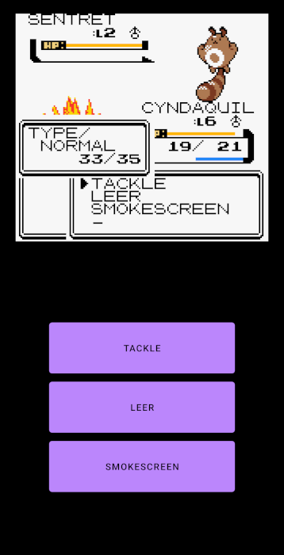

# Pokémon Crystal with touch controls

   

## How to build

First, you need to build https://github.com/pret/pokecrystal to get the correct version of Pokémon Crystal.
Put that in `app/src/main/res/raw` with the exact name `pokecrystal.gbc`, then you can build this project.
